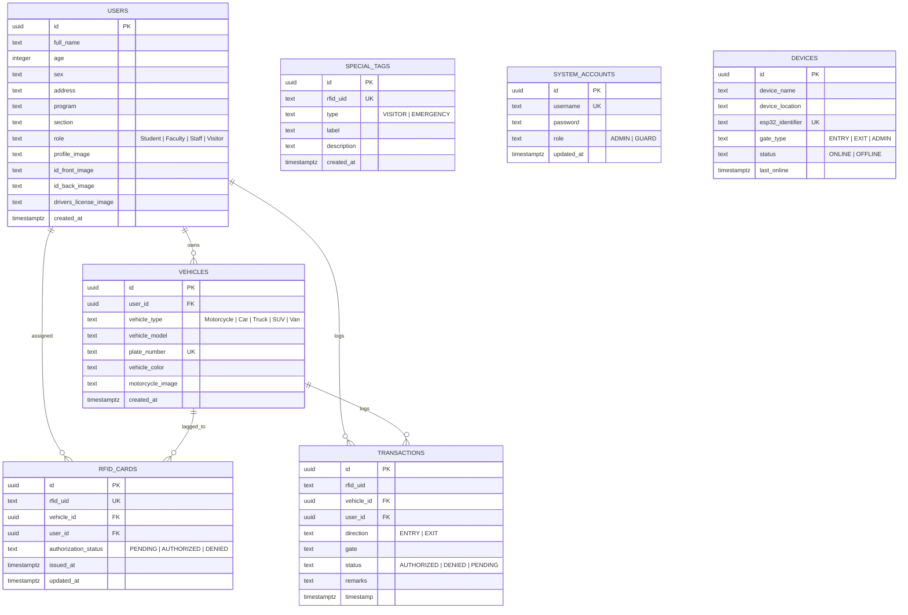
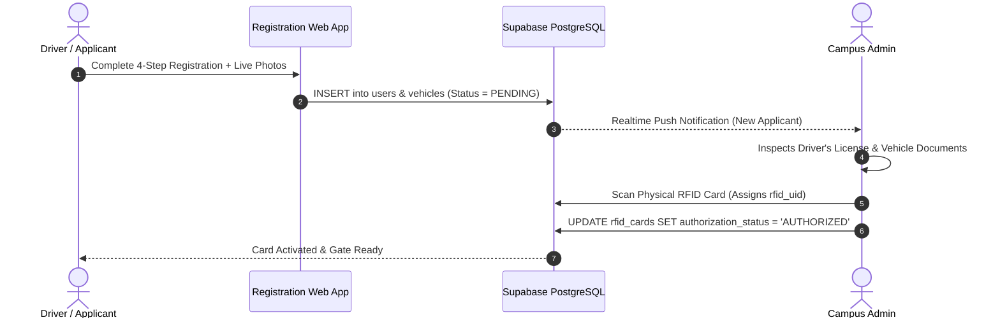
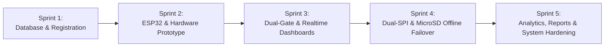

# CHARRMPASS — System Architecture & Technical Specification

> **Campus Hybrid Automated RFID Real-time Management Parking & Access Security System**  
> *Complete Technical Reference, Architectural Blueprint, Logic Flows, Algorithms, Security Analysis, and SDLC.*

---

## 1. Executive System Landscape

CHARRMPASS is an enterprise-grade, dual-gate physical access control and parking management ecosystem. It integrates **IoT edge microcontrollers (ESP32)**, **high-frequency RFID readers (MFRC522)**, **PostgreSQL cloud database (Supabase)**, and **real-time responsive web interfaces (Admin, Guard, Entry Gate, Exit Gate, Registration)**.

```
+----------------------------------------------------------------------------------------------------+
|                                      CHARRMPASS SYSTEM LANDSCAPE                                    |
+----------------------------------------------------------------------------------------------------+
|                                                                                                    |
|  [ REGISTRATION PORTAL ]               [ ADMIN CONTROL HUB ]             [ GUARD STATION DASHBOARD ]|
|  - Multi-step Verification             - RFID Tag Assignment             - Live Tap Feeds          |
|  - Camera Photo Capture                - Analytics & Charts              - Manual Override Entry   |
|  - ID & License Upload                 - System Auditing & Reports       - Visitor & Emergency Tags|
|            |                                     |                                   |             |
|            +-------------------------------------+-----------------------------------+             |
|                                                  |                                                 |
|                                       (HTTPS / WSS Realtime)                                       |
|                                                  v                                                 |
|                             +------------------------------------------+                           |
|                             |             SUPABASE CLOUD               |                           |
|                             |  - PostgreSQL 15 Relational Schema       |                           |
|                             |  - PostgREST HTTP Engine                 |                           |
|                             |  - WebSocket Realtime Event Bus          |                           |
|                             |  - Storage Buckets (Photos & Documents)  |                           |
|                             +------------------------------------------+                           |
|                                         ^                      ^                                   |
|                                (HTTPS REST)                  (HTTPS REST)                          |
|                                         |                      |                                   |
|                    +--------------------+                      +--------------------+              |
|                    |                                                                |              |
|        [ ENTRY GATE UNIT (ESP32) ]                                      [ EXIT GATE UNIT (ESP32) ] |
|        - Dedicated VSPI: MFRC522 Reader                                 - Dedicated VSPI: MFRC522   |
|        - Dedicated HSPI: MicroSD Module                                 - Dedicated HSPI: MicroSD   |
|        - I2C 16x2 LCD + Buzzer + LEDs                                   - I2C 16x2 LCD + Buzzer     |
|        - Offline Whitelist Cache                                        - Offline Whitelist Cache   |
+----------------------------------------------------------------------------------------------------+
```

---

## 2. Relational Database Architecture (Data Schema)

The backend runs on **PostgreSQL 15** hosted on **Supabase**. The database uses strict foreign key cascades, independent transaction logging for dual gates, and publication-based WebSocket broadcasting.



---

## 3. End-to-End System Logic & Flow of Operations

### 3.1 Registration & Verification Flow
1. **Applicant Submission**: The driver fills out the 4-step wizard in `register.html` (Personal Info $\rightarrow$ Live Photo & ID/License Uploads $\rightarrow$ Vehicle Specs $\rightarrow$ Review).
2. **Database Ingestion**: Creates rows in `users` and `vehicles` with an unassigned / pending card status.
3. **Admin Review & RFID Pairing**: Campus administrator verifies documents in `admin-dashboard.html`, taps a physical card to assign `rfid_uid`, and marks status as `AUTHORIZED`.



---

### 3.2 Gate Entry RFID Tap Execution (Online & Offline Fallback)

```mermaid
flowchart TD
    Start([RFID Card Tapped on Entry Gate]) --> Debounce{Cooldown Active?<br/>millis < lastScan + 4000ms}
    Debounce -- Yes --> Ignore[Ignore Scan / Debounce Filter]
    Debounce -- No --> ReadUID[Extract 4-Byte Hex UID e.g., 'B7 78 96 31']
    
    ReadUID --> CheckNet{WiFi Connected &<br/>Supabase Reachable?}
    
    %% Online Branch
    CheckNet -- Yes --> QuerySpecial[Query /rest/v1/special_tags]
    QuerySpecial --> IsSpecial{Found Special Tag?}
    IsSpecial -- Yes (EMERGENCY / VISITOR) --> AuthGrant[Status = AUTHORIZED]
    IsSpecial -- No --> QueryCards[Query /rest/v1/rfid_cards with Joins]
    QueryCards --> CardFound{Card Found &<br/>Status == 'AUTHORIZED'?}
    CardFound -- Yes --> AuthGrant
    CardFound -- No --> AuthDeny[Status = DENIED]
    
    %% Offline Branch
    CheckNet -- No --> OpenSD[Read /authorized_cards.csv on MicroSD]
    OpenSD --> MatchCSV{UID match in local CSV?}
    MatchCSV -- Yes --> OfflineAuth[Status = AUTHORIZED (Offline)]
    MatchCSV -- No --> OfflineDeny[Status = DENIED (Offline)]
    
    %% Action Execution
    AuthGrant --> PostCloudLog[HTTP POST /rest/v1/transactions<br/>direction = 'ENTRY', status = 'AUTHORIZED']
    AuthDeny --> PostCloudDeny[HTTP POST /rest/v1/transactions<br/>direction = 'ENTRY', status = 'DENIED']
    
    OfflineAuth --> WriteSDLog[Append to /offline_txns.csv on SD Card]
    OfflineDeny --> WriteSDLog
    
    PostCloudLog --> GateOpen[Green LED ON + 2x Buzzer Beep + LCD Welcome]
    OfflineAuth --> GateOpen
    
    PostCloudDeny --> GateLock[Red LED ON + Long Buzzer Beep + LCD Access Denied]
    OfflineDeny --> GateLock
```

---

### 3.3 Gate Exit & Campus Occupancy Logic
1. Outbound vehicle scans at the Exit Gate.
2. System logs an independent transaction with `direction = 'EXIT'`.
3. Live campus occupancy is continuously computed:
   $$\text{Campus Occupancy} = \sum (\text{AUTHORIZED ENTRY}) - \sum (\text{AUTHORIZED EXIT})$$

---

### 3.4 Offline Recovery & Background Synchronization Flow
1. During internet disruptions, scans are evaluated against `/authorized_cards.csv` and logged to `/offline_txns.csv`.
2. When WiFi reconnects, the ESP32 activates `syncOfflineTransactionsToCloud()`, reading `/offline_txns.csv` line-by-line and HTTP POSTing each record with remarks `"[OFFLINE SYNC] ..."`.
3. Upon full confirmation (HTTP 201), `/offline_txns.csv` is safely deleted, and `syncWhitelistToSD()` refreshes the local whitelist cache.

---

## 4. Algorithms & Core Computational Methods

### 4.1 RFID Interrogation & Anti-Collision Algorithm (ISO/IEC 14443-A)
- Operates at **13.56 MHz**.
- Executes Request-A (`REQA`, command `0x26`) to discover cards.
- Runs binary-tree anti-collision bit-framing (`PICC_ReadCardSerial()`) to isolate single cards when multiple tags enter the field.
- Normalizes raw byte stream to canonical space-delimited Hex (`"B7 78 96 31"`).

### 4.2 Sliding-Window Scan Cooldown / Debounce
Prevents multiple rapid-fire transaction logs from a single physical tap:
```cpp
unsigned long lastScanTime = 0;
const unsigned long SCAN_COOLDOWN = 4000; // 4000 ms sliding window

if (millis() - lastScanTime < SCAN_COOLDOWN) return; // Ignore bounce
lastScanTime = millis();
```

### 4.3 Dual-Hardware SPI Bus Separation
Solves voltage mismatch and signal contention (RFID at 3.3V vs SD Module at 5V):
- **VSPI Bus (GPIO 18, 19, 23, 5)** $\rightarrow$ Dedicated exclusively to MFRC522 RFID Reader.
- **HSPI Bus (GPIO 26, 14, 12, 13)** $\rightarrow$ Dedicated exclusively to MicroSD Card Module.

### 4.4 Event-Driven Architecture (EDA) & Change Data Capture (CDC)
- Uses PostgreSQL logical replication (`supabase_realtime` publication) rather than polling.
- Gate scan triggers `INSERT` $\rightarrow$ Supabase converts to WebSocket message $\rightarrow$ Guard & Exit dashboards reactively re-render in under 200ms.

### 4.5 Rule-Based Access Control (RBAC) & Decision Hierarchy
Evaluates rules in deterministic sequence:
1. **Rule 1 (Emergency Priority)**: `Tag.Type == EMERGENCY` $\rightarrow$ Grant unconditional entry, siren trigger.
2. **Rule 2 (Visitor Pass)**: `Tag.Type == VISITOR` $\rightarrow$ Grant entry with visitor badge metadata.
3. **Rule 3 (Registered Member)**: `Tag.Status == AUTHORIZED` $\rightarrow$ Grant entry, display driver name and plate.
4. **Rule 4 (Pending / Denied)**: `Tag.Status IN ('PENDING', 'DENIED')` $\rightarrow$ Deny access, display specific status.
5. **Rule 5 (Fail-Safe Offline)**: If offline, evaluate Rules 1–3 against local SD Card cache.

---

## 5. Security Architecture & Evaluation

| Security Layer | Implementation in CHARRMPASS | Rating | Analysis / Mitigations |
| :--- | :--- | :--- | :--- |
| **Data in Transit** | TLS 1.3 / HTTPS & WSS (WebSockets) | **High** | All payloads between ESP32/Web clients and Supabase are encrypted against sniffing. |
| **Data at Rest** | PostgreSQL AES-256 Storage Encryption | **High** | Physical cloud disk encryption managed by Supabase/AWS infrastructure. |
| **Network Resilience** | Local MicroSD Whitelist Fallback | **High** | Complete immunity to gate lockouts during internet outages. |
| **Firmware Memory** | Fixed dynamic JSON buffers (`512` to `8192` bytes) | **High** | Prevents ESP32 heap fragmentation and memory leaks over long uptimes. |
| **Physical RFID Security** | Mifare 13.56MHz 4-Byte UID + Visual Guard Verification | **Moderate** | UID reads are corroborated by guard dashboard photo-matching (driver photo + vehicle plate). |

---

## 6. Software Development Life Cycle (SDLC) — Agile Scrum

CHARRMPASS was engineered using the **Agile Scrum Methodology with an Iterative-Incremental Approach** across 5 distinct sprints:



- **Why Agile was chosen over Waterfall**: IoT and embedded hardware-software systems require continuous hardware-in-the-loop validation. Agile enabled rapid architectural pivots (such as splitting SPI into dedicated VSPI/HSPI controllers and creating the offline cache when network dropouts occurred).

---

## 7. System Module Inventory

| # | Module Name | Primary Responsibility | Tech Stack / File |
| :---: | :--- | :--- | :--- |
| **1** | **RFID Reader Module** | 13.56MHz polling, anti-collision, UID extraction | C++, MFRC522 (`esp32_rfid_entry.ino`) |
| **2** | **Dual-SPI Arbitrage Module** | Signal isolation between RFID and SD Card | C++, ESP32 Hardware VSPI / HSPI |
| **3** | **Hardware Signage Module** | Visual LCD feedback, status LEDs, buzzer tones | C++, I2C HD44780, GPIOs |
| **4** | **Offline Whitelist Cache** | Local fallback database on MicroSD | C++, FAT32 SD File System |
| **5** | **Offline Sync Engine** | Network recovery log replay to cloud | C++, HTTPClient, ArduinoJson |
| **6** | **Applicant Stepper Module** | 4-step guided registration wizard | JS, HTML5, CSS3 (`register.js`) |
| **7** | **Camera & Document Capture** | Live photo capture and legal document upload | WebRTC `getUserMedia`, Canvas API |
| **8** | **Vehicle Profiling Module** | Vehicle specifications & user foreign keys | JavaScript, PostgreSQL FKs |
| **9** | **Dual-Gate Direction Module** | Inbound/Outbound transaction routing | JavaScript, REST API (`entry-app.js`, `exit-app.js`) |
| **10** | **Live Guard Monitor Module** | WebSocket real-time tap feed with photo matching | JavaScript, Supabase Realtime (`guard-app.js`) |
| **11** | **Manual Override Module** | Guard manual entry and custom remarks | JavaScript, DOM Events (`guard-app.js`) |
| **12** | **Visitor & Emergency Module** | Temporary pass assignment & emergency override | JavaScript, SQL (`admin-app.js`, `guard-app.js`) |
| **13** | **Campus Occupancy Tracker** | Differential headcount & anti-passback | JavaScript, Real-time Aggregations |
| **14** | **RFID Credential Issuance** | Admin verification & physical UID pairing | JavaScript, Supabase Client (`admin-app.js`) |
| **15** | **Visual Analytics Module** | Hourly traffic trends & role distribution charts | Chart.js, HTML5 Canvas (`admin-app.js`) |
| **16** | **Audit Logging & Export** | Searchable audit trail with CSV / PDF export | JavaScript, jsPDF, CSV Parser |
